# Architecture

Job Finding Assistant is a fully local, AI-assisted job-application agent.
Reasoning (matching, writing, classifying) is delegated to a local LLM via
LM Studio or Ollama. Browser interaction is deterministic Playwright code
— the AI never "clicks random buttons".

## Supervised runtime (v0.2)

- **AutomationRuntime** (`app/runtime/automation_runtime.py`) — pause/stop, manual control, browser telemetry
- **DiscoveryScheduler** (`app/runtime/discovery_scheduler.py`) — background source polling
- **SourceOrchestrator** + `app/sources/*` — LinkedIn + Raytheon full; Indeed/Glassdoor/L3Harris/TI scaffolded
- **ApprovalService** — persistent `approval_checkpoints`; universal pre-submit gate
- **EventBus** → WebSocket `/ws/events` — live Control Center and Live Browser UI

## Top-level component map

```
+--------------------+          +------------------------+
|     Typer CLI      |          |       FastAPI app      |
|  (app/cli/...)     |          |     (app/api/...)      |
+----------+---------+          +-----------+------------+
           |                                |
           v                                v
+--------------------------------------------------------+
|                      Pipelines                         |
| ingest_pipeline / score / tailor / apply               |
| (app/pipelines/*.py)                                   |
+----+----------------+--------------+--------+----------+
     |                |              |        |
     v                v              v        v
+----------+   +-------------+   +---------+  +----------+
|   ATS    |   |     LLM     |   | Resume  |  | Services |
| adapters |   |  providers  |   | tailor/ |  | (memory, |
| (base+   |   | (LMStudio/  |   | render  |  | blacklist|
| 4 impls) |   |   Ollama)   |   | DOCX+PDF|  | etc.)    |
+----+-----+   +------+------+   +---------+  +----------+
     |                |
     v                v
+----------+   +-------------+
| Playwright|  | HTTPX +     |
| persistent|  | tenacity    |
| context   |  | retries     |
+-----------+  +-------------+

       v
+--------------------------------------------------------+
|  SQLAlchemy (async) on SQLite at data/jobassist.db     |
|  Tables: companies, jobs, job_scores, resume_versions, |
|  applications, application_events, generated_answers   |
+--------------------------------------------------------+

       v
+--------------------------------------------------------+
|  ChromaDB persistent collection for question memory    |
+--------------------------------------------------------+
```

## Pipeline flow

```mermaid
flowchart LR
    User[User CLI/API] --> Ingest[ingest_pipeline]
    Ingest --> Detect[detect_adapter_class]
    Detect --> AdapterScrape[adapter.scrape_job]
    AdapterScrape --> Blacklist[Blacklist filter]
    Blacklist -->|allowed| DB1[(jobs upsert)]
    DB1 --> Score[score_pipeline]
    Score --> LLM1[LLMProvider.chat_json]
    LLM1 --> DB2[(job_scores)]
    DB2 --> Tailor[tailor_pipeline]
    Tailor --> LLM2[LLMProvider.chat_json]
    LLM2 --> Render[render_docx + render_pdf]
    Render --> DB3[(resume_versions)]
    DB3 --> Apply[apply_pipeline]
    Apply --> Browser[BrowserSession]
    Browser --> AdapterFill[adapter.fill_application]
    AdapterFill --> Branch{mode}
    Branch -->|dry_run| Report[DryRunReport]
    Branch -->|human_review| Pause[awaiting_review]
    Branch -->|auto + allowed| Submit[adapter.submit]
    Submit --> DB4[(applications + events)]
```



## Module responsibilities

| Module | Role |
| --- | --- |
| `app/config/` | Path resolution, Pydantic schemas, YAML+JSON loader. |
| `app/models/` | Pure Pydantic domain types (`Profile`, `Job`, `JobScore`, ...). |
| `app/database/` | SQLAlchemy ORM, async engine, session scope, DAO functions. |
| `app/llm/` | `LLMProvider` Protocol, LM Studio + Ollama implementations, Jinja2 prompt registry. |
| `app/prompts/` | Jinja2 templates (one per use case). |
| `app/resume/` | Master loader, LLM tailor + cover letter, DOCX/PDF renderers, template configs. |
| `app/services/` | Cross-cutting helpers (question memory in Chroma, blacklist filter). |
| `app/automation/` | Playwright `BrowserSession`, retry decorator, screenshot helpers, shared selectors. |
| `app/ats/` | Adapter ABC + four implementations + registry. |
| `app/pipelines/` | Orchestrate the above into ingest / score / tailor / apply workflows. |
| `app/cli/` | Typer commands invoking the pipelines. |
| `app/api/` | FastAPI inspection routes. |

## Safety model

- Every adapter defaults to `human_review` mode. A filled application sits
  with status `awaiting_review` until the user runs `jobassist review --approve <id>`.
- Auto-submit requires BOTH `preferences.apply.allow_auto_submit: true` AND
  the `--auto` flag on the CLI command. Either alone falls back to human review.
- LinkedIn is **assist only**: the adapter never clicks "Submit application".
  It raises `SubmitError` if you try.
- Every adapter takes screenshots on success and failure under
  `data/screenshots/` for after-the-fact triage.

## Persistence

- SQLite at `data/jobassist.db` (async via `aiosqlite`).
- ChromaDB at `data/cache/chroma/` for question memory.
- DOCX + PDF resumes at `data/resumes/generated/job_<id>/`.
- Playwright user data at `data/browser_profiles/<profile>/`.

## Logging

Structlog writes:

- JSON-line logs to `data/logs/app.log` (rotated at 5 MB, 5 backups).
- Console output to stderr (colored unless `JOBASSIST_LOG_LEVEL` is JSON-mode).

Set `JOBASSIST_LOG_LEVEL=DEBUG` for verbose tracing.
